# Bugku CTF WriteUp Misc类

1. 签到题

  没啥好说的，直接关注公众号。

2. 这是一张单纯的图片

  下载题目中提供的文件，是一张萌萌的图片。

  

  kali中自带了binwalk,直接binwalk分析一波，没有异常。

  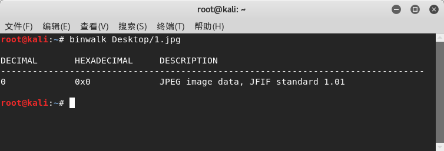

  考虑查看图片编码内容，kali没有比较方便的编辑器，到[官方下载](http://www.sweetscape.com/download/010editor/)010editor([使用教程](https://zhuanlan.zhihu.com/p/31195150))

  安装好之后打开图片，看到文件末尾有些奇怪的字符像html编码

  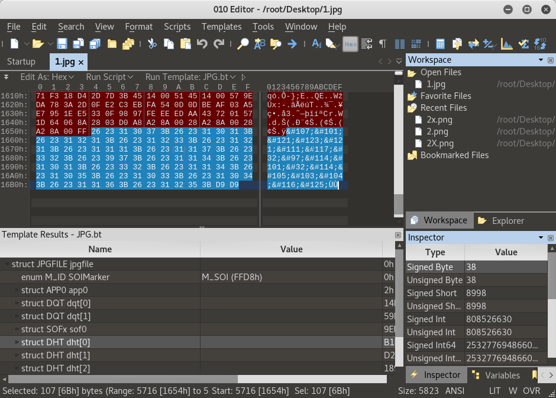

  随手使用kali自带的burpsuite翻译，拿到flag
  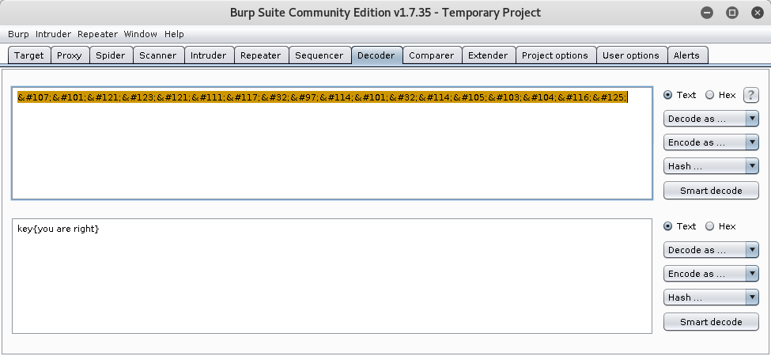  


3. 隐写

  下载题目提供图片，打开报错，kali自带的编辑器还特别贴心的告诉了你是IHDR部分的CRC校验不过。

  使用010editor打开，IHDR这部分包含了长度宽度的值，把高的值修改成和宽一致后再打开拿到flag。010editor真是神器，下  载特定格式文件的分析插件后，可以直接在下面框框内修改内容。以前都是需要在Edit->Insert/Overwrite/里面修改或更新十 六进制内容，修改前还要找修改的内容在哪个地方。

  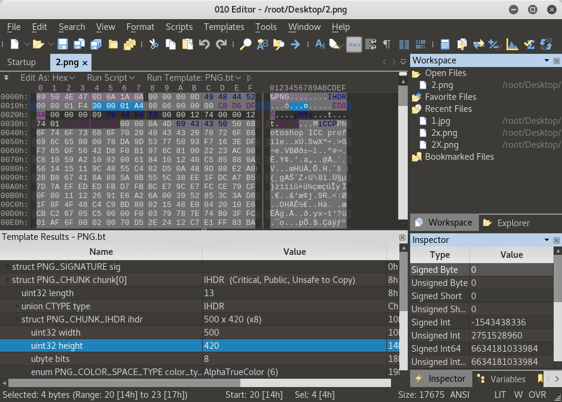   

4. telnet

  下载了文件是一个pcap包，大致看了一下是一个telnet通讯的过程~~废话，题目都说了好吗~~

  跟踪一下TCP流(telnet协议也是TCP/IP中的一种协议)。

  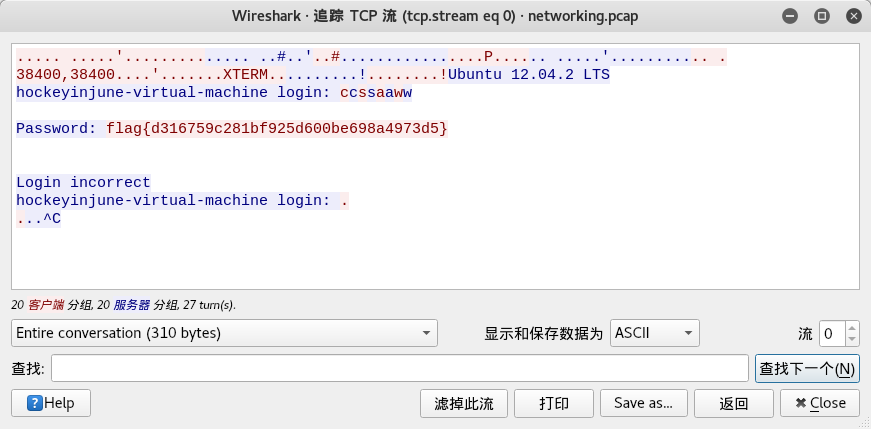

  额。。   

5. 眼见非实

  下载题目提供压缩包，发现里面绝大多数是一些xml配置文件，翻到某个文件看到了flag。

  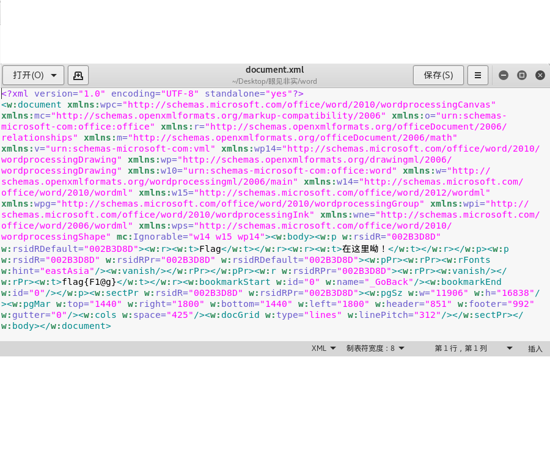

  对于这种题目，因为在之前的考试中也遇到过，是否应该考虑写一个遍历字符串的脚本来处理呢？
  // TODO

6. 啊哒

  下载题目提供压缩包，里面有一个图片

  

  常规操作，binwalk走几步

  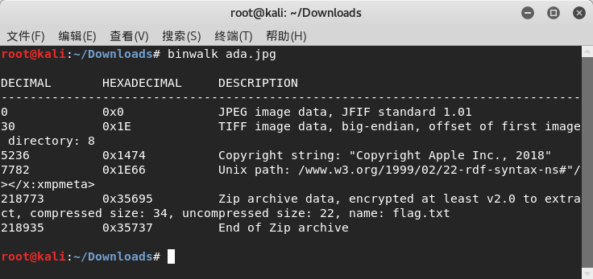  

  发现文件末尾有压缩包，使用010editor把末尾内容复制出来另存为zip格式，压缩包里面有flag文件。但是压缩包是加密的，本想暴力破解但是比较难猜，回头发现这个题目的第一张图，相机位置有可疑代码。解码后拿到解压密码，顺利解题。

  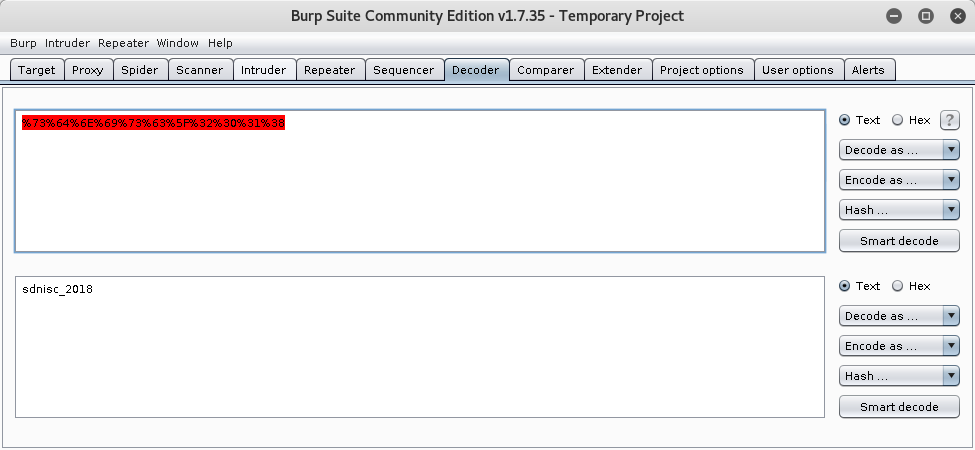

7. 又一张图片，还单纯吗

  下载题目图片，binwalk看一下，就知道是来搞事情的。

  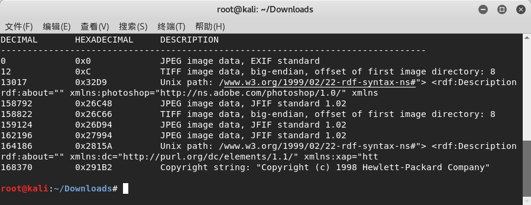

  看这个也不知道怎么下手，直接使用010editor。真的，这个软件的分析插件可以吹爆，太好用了，完全适合解决这类CTF题目。

  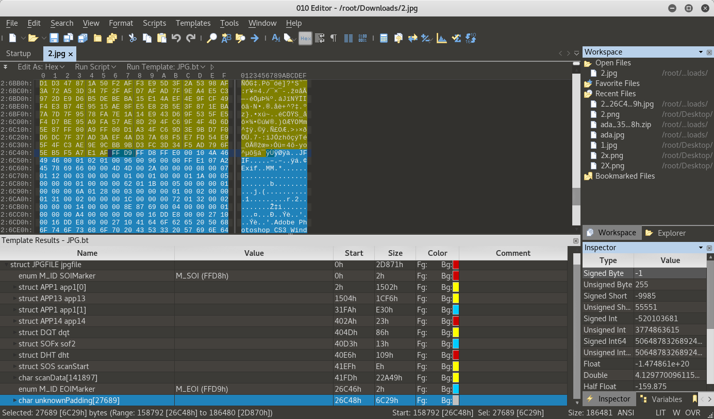  

  可以从图片中看到，最后一段是未知填充。其实这段未知填充和上一段结束接着的地方是FFD9FFD8。直接导出这段Unknow，另存为jpg，于是拿到Flag.

  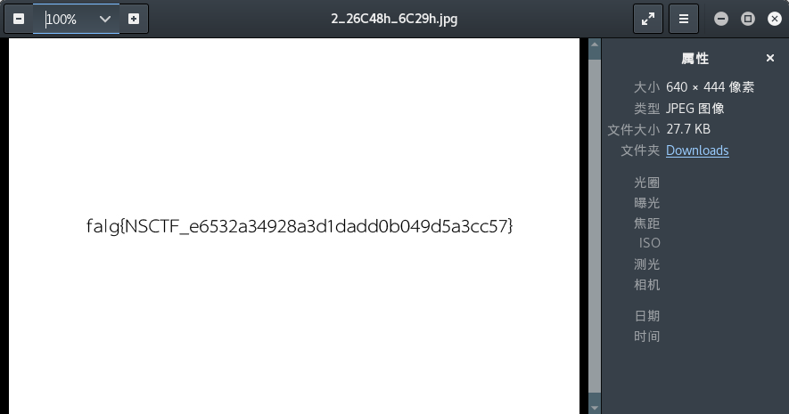  


8. 猜

  下载图片，发现是女神，答案填写flag{liuyifei}

9. 宽带信息泄露

  经过查看其它答案，下载的文件应该是一个路由器保存的配置，需要使用RouterPassView软件，暂时身边没有windows系统的。以后再补。

10. 隐写2

  下载文件是一个图片
  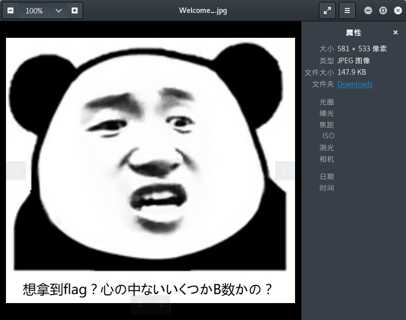

  下载文件是一个图片
  

  binwalk走一波

  

  看到文件里面似乎躲藏了东西。同时解锁了新技能，使用binwalk的命令`-e`分离文件内容

  `binwalk -e Welcome_.jpg`

  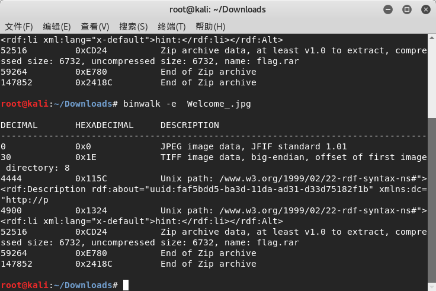

  分离出了一个图片提示以及flag.rar文件

  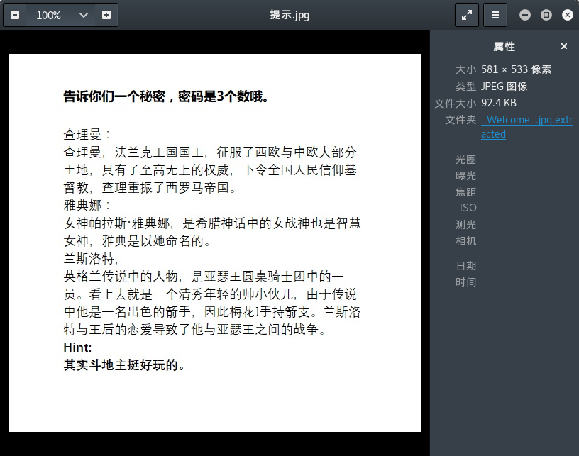  

  同时binwalk查看flag文件内容

  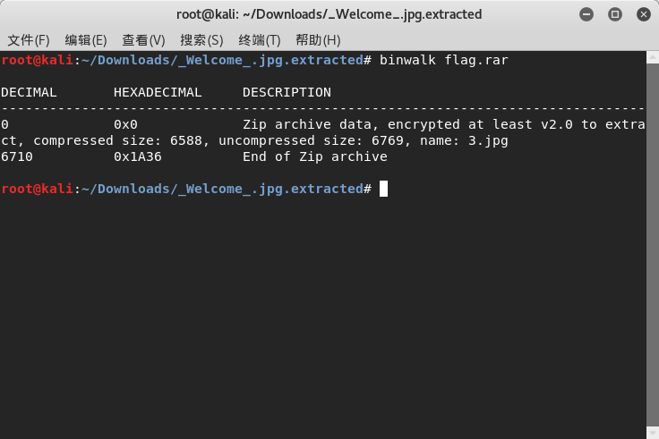

  是一个zip文件，打开后发现是加密的。下载了解密软件rarcrack进行破解(记得把文件后缀从rar改成zip)。**这个软件是专门用来破解压缩文件的，想起来当年居然自己还要自己写脚本跑**

  

  解密后又是一张图片

  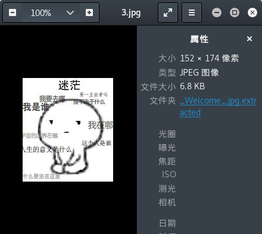  

  使用binwalk看没什么问题。使用Linux自带的16进制编辑器查看文件16进制内容，发现末尾有奇怪。**使用了默认自带的16进制软件xxd**

  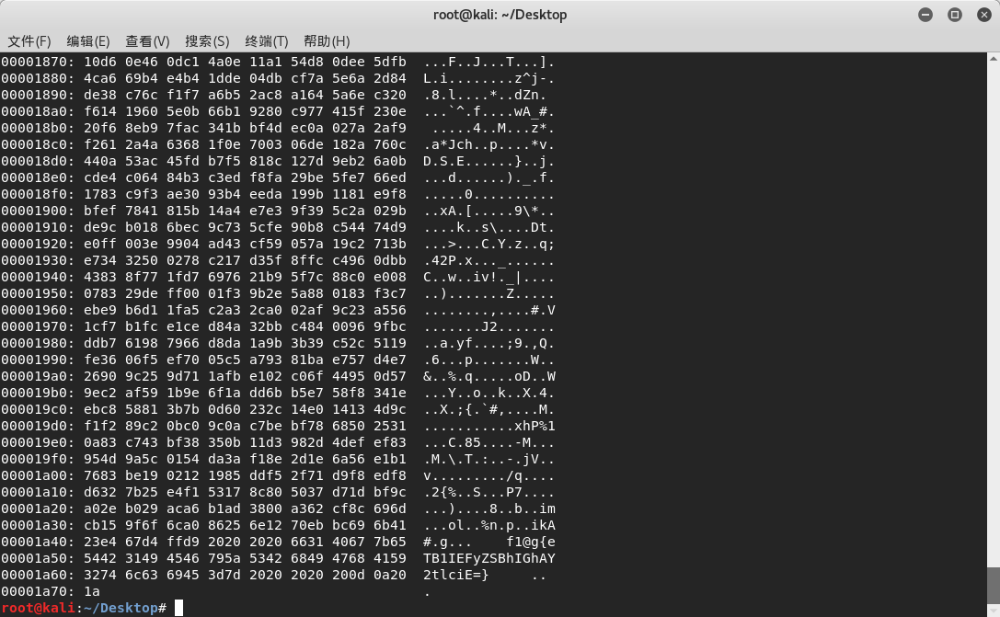

  看来是一个base64加密的，解密后拿到flag.

11. 多种方法解决

  下载来是一个KEY.exe文件，使用binwalk无法分析。直接cat看看情况，发现是一个图片。

  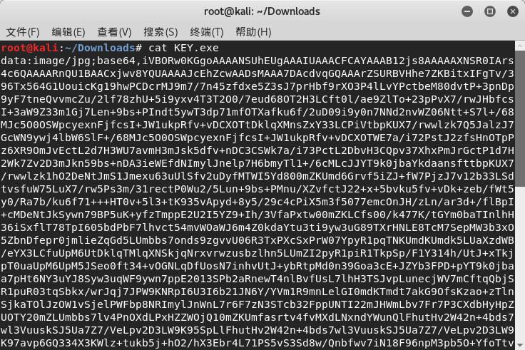

  使用网上现成的base64转图片拿到二维码，扫描后得到flag。

12. 闪得好快

  打开题目是一个不停变换的gif二维码图片。

  

  需要分析二维码图片就需要下载一个gif分析工具，叫做stegsolve。因为这个工具kali里面没有，所以先执行以下操作进行安装。

  ```
  wget http://www.caesum.com/handbook/Stegsolve.jar -O stegsolve.jar

  chmod +x stegsolve.jar
  ```

  安装好以后可以看到执行命令的目录下面已经有stegsolve.jar文件了。这时候使用命令打开文件
  `java -jar stegsolve.jar`

  软件打开后首先加载文件，然后使用Analyse->frame Browser就可以一帧一帧的二维码图了。把这18张图片的内容都扫描出来，就是答案了。

13. 白哥的鸽子:

  下载来一张图片。binwalk看了一下没什么特别的，用xxd看看16进制，发现末尾有古怪。

  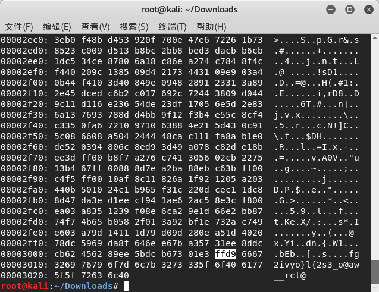

  JPEG图片开头是ffd8，末尾应该是ffd9.后面多出来一些内容，先把16进制转换成字符串

  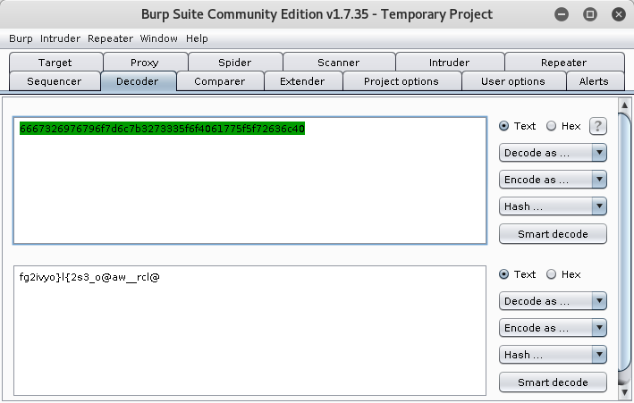

  按经验判断是一个栅栏密码，上网解码得到flag

  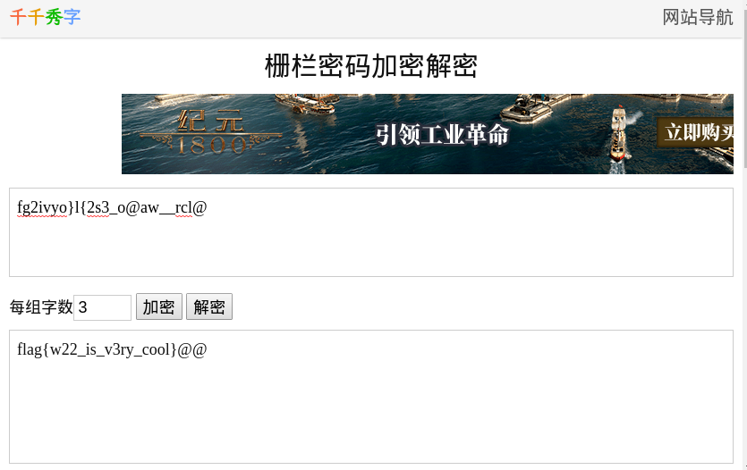

14. linux

  这个题目有几种解法。

  解法一：

  下载到文件后，用binwalk分析一波，看到好像是由几个文件组成的。于是使用binwalk -e的命令将文件都分解出来，得到一个flag文本。里面就是flag

  解法二:

  下载到文件后使用`strings flag | grep flag`找其中的flag内容。

15. 隐写3

  下载来是一个图片。打开后提示CRC校验码出错，考虑是宽高被改动过了无法显示。这边有个小提示，windows下会忽略CRC校验码错误，显示图片。但是linux下会因为CRC校验码出错无法显示。

  使用系统自带工具hexeditor打开，17~20字节00 00 02 A7是宽，21~24字节00 00 01 00是高，30~33字节6D 7C 71 35是CRC校验码。

  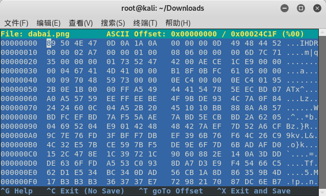

  随便修改了一下高度，图片还是无法显示(如果是windows系统里面，修改就会正常显示了)。于是在网上找了现成的计算代码，运行后会重新生成一个正常的图片。
  ```
import zlib
import struct
#读文件
file = 'dabai.png'
fr = open(file,'rb').read()
data = bytearray(fr[12:29])
crc32key =  0x6D7C7135 #需要自己填写30～33的16进制校验码
#crc32key = eval(str(fr[29:33]).replace('\\x','').replace("b'",'0x').replace("'",''))
n = 4095 #理论上0xffffffff,但考虑到屏幕实际，0x0fff就差不多了
for w in range(n):#高和宽一起爆破
    width = bytearray(struct.pack('>i', w))#q为8字节，i为4字节，h为2字节
    for h in range(n):
        height = bytearray(struct.pack('>i', h))
        for x in range(4):
            data[x+4] = width[x]
            data[x+8] = height[x]
            #print(data)
        crc32result = zlib.crc32(data)
        if crc32result == crc32key:
            print(width,height)
            #写文件
            newpic = bytearray(fr)
            for x in range(4):
                newpic[x+16] = width[x]
                newpic[x+20] = height[x]
            fw = open(file+'.png','wb')#保存副本
            fw.write(newpic)
            fw.close
  ```
  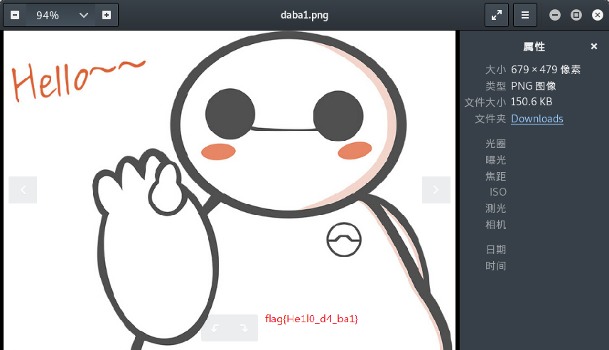
