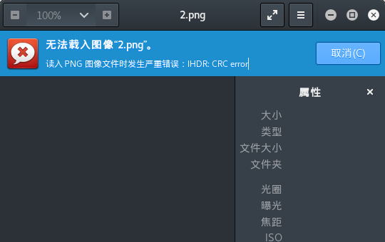

# Bugku CTF WriteUp

Bugku网站有比较全的[CTF题目](https://ctf.bugku.com/)。用来刷题练习并借此熟悉Kali的工具

## 0x00 Misc

1. 签到题

  没啥好说的，直接关注公众号。

2. 这是一张单纯的图片

  下载题目中提供的文件，是一张萌萌的图片。

  

  kali中自带了binwalk,直接binwalk分析一波，没有异常。

  

  考虑查看图片编码内容，kali没有比较方便的编辑器，到[官方下载](http://www.sweetscape.com/download/010editor/)010editor([使用教程](https://zhuanlan.zhihu.com/p/31195150))

  安装好之后打开图片，看到文件末尾有些奇怪的字符像html编码

  

  随手使用kali自带的burpsuite翻译，拿到flag

    

3. 隐写

  下载题目提供图片，打开报错，kali自带的编辑器还特别贴心的告诉了你是IHDR部分的CRC校验不过。

      

  使用010editor打开，IHDR这部分包含了长度宽度的值，把高的值修改成和宽一致后再打开拿到flag。010editor真是神器，下载特定格式文件的分析插件后，可以直接在下面框框内修改内容。以前都是需要在Edit->Insert/Overwrite/里面修改或更新十六进制内容，修改前还要找修改的内容在哪个地方。

     

4. telnet

  下载了文件是一个pcap包，大致看了一下是一个telnet通讯的过程~~废话，题目都说了好吗~~

  跟踪一下TCP流(telnet协议也是TCP/IP中的一种协议)。

  

  额。。   
