# Bugku CTF WriteUp

Bugku网站有比较全的[CTF题目](https://ctf.bugku.com/)。用来刷题练习并借此熟悉Kali的工具

## 0x01 Misc

1. 签到题

  没啥好说的，直接关注公众号。

2. 这是一张单纯的图片

  下载题目中提供的文件，是一张萌萌的图片。

  

  kali中自带了binwalk,直接binwalk分析一波，没有异常。

  

  考虑查看图片编码内容，kali没有比较方便的编辑器，到[官方下载](http://www.sweetscape.com/download/010editor/)010editor([使用教程](https://zhuanlan.zhihu.com/p/31195150))

  安装好之后打开图片，看到文件末尾有些奇怪的字符像html编码

  

  随手使用kali自带的burpsuite翻译，拿到flag
    


3. 隐写

  下载题目提供图片，打开报错，kali自带的编辑器还特别贴心的告诉了你是IHDR部分的CRC校验不过。

  使用010editor打开，IHDR这部分包含了长度宽度的值，把高的值修改成和宽一致后再打开拿到flag。010editor真是神器，下  载特定格式文件的分析插件后，可以直接在下面框框内修改内容。以前都是需要在Edit->Insert/Overwrite/里面修改或更新十 六进制内容，修改前还要找修改的内容在哪个地方。

     

4. telnet

  下载了文件是一个pcap包，大致看了一下是一个telnet通讯的过程~~废话，题目都说了好吗~~

  跟踪一下TCP流(telnet协议也是TCP/IP中的一种协议)。

  

  额。。   

5. 眼见非实

  下载题目提供压缩包，发现里面绝大多数是一些xml配置文件，翻到某个文件看到了flag。

  

  对于这种题目，因为在之前的考试中也遇到过，是否应该考虑写一个遍历字符串的脚本来处理呢？
  // TODO

6. 啊哒

  下载题目提供压缩包，里面有一个图片

  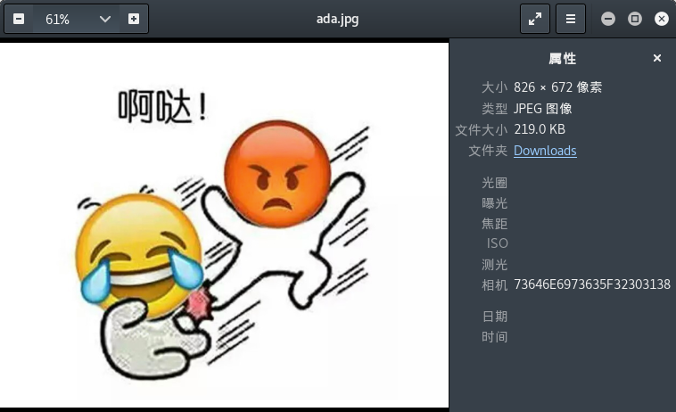

  常规操作，binwalk走几步

    

  发现文件末尾有压缩包，使用010editor把末尾内容复制出来另存为zip格式，压缩包里面有flag文件。但是压缩包是加密的，本想暴力破解但是比较难猜，回头发现这个题目的第一张图，相机位置有可疑代码。解码后拿到解压密码，顺利解题。

  

7. 又一张图片，还单纯吗

  下载题目图片，binwalk看一下，就知道是来搞事情的。

  

  看这个也不知道怎么下手，直接使用010editor。真的，这个软件的分析插件可以吹爆，太好用了，完全适合解决这类CTF题目。

  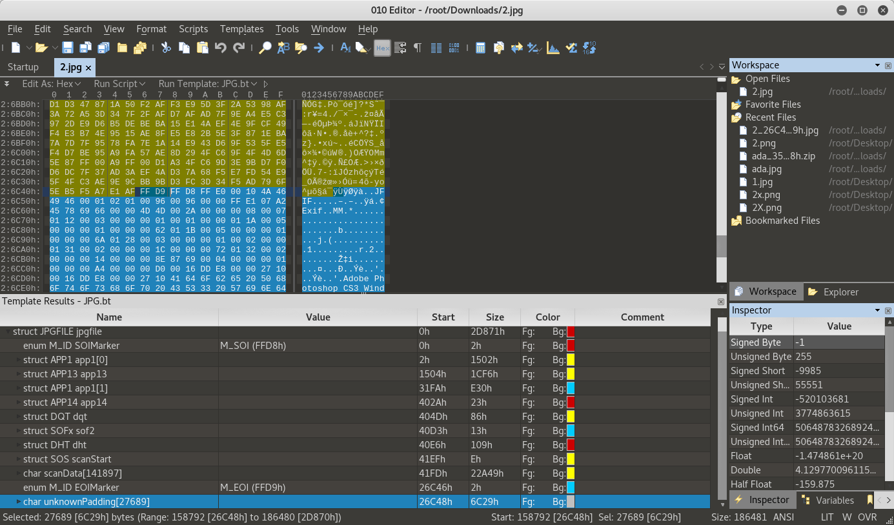  

  可以从图片中看到，最后一段是未知填充。其实这段未知填充和上一段结束接着的地方是FFD9FFD8。直接导出这段Unknow，另存为jpg，于是拿到Flag.

  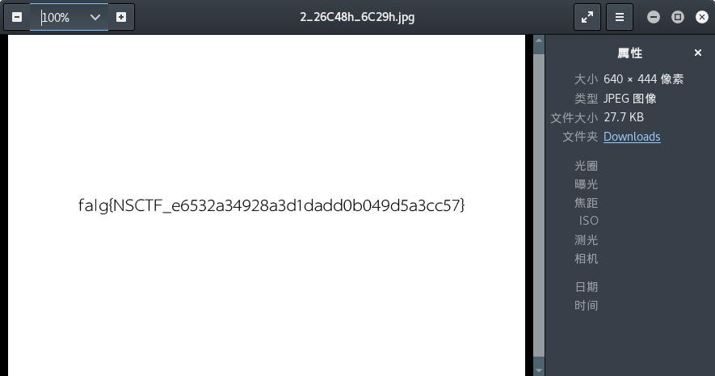  


8. 猜

  下载图片，发现是女神，答案填写flag{liuyifei}

9. 宽带信息泄露

  经过查看其它答案，下载的文件应该是一个路由器保存的配置，需要使用RouterPassView软件，暂时身边没有windows系统的。以后再补。

10. 隐写2

  下载文件是一个图片
  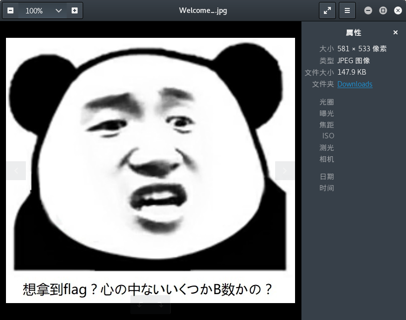

  下载文件是一个图片
  

  binwalk走一波

  

  看到文件里面似乎躲藏了东西。同时解锁了新技能，使用binwalk的命令`-e`分离文件内容

  `binwalk -e Welcome_.jpg`

  

  分离出了一个图片提示以及flag.rar文件

    

  同时binwalk查看flag文件内容

  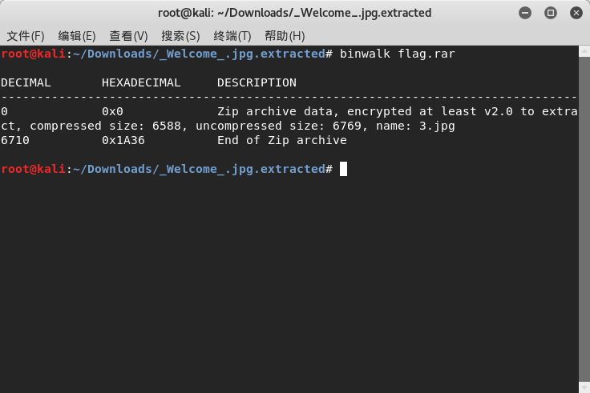

  是一个zip文件，打开后发现是加密的。下载了解密软件rarcrack进行破解(记得把文件后缀从rar改成zip)。**这个软件是专门用来破解压缩文件的，想起来当年居然自己还要自己写脚本跑**

  

  解密后又是一张图片

    

  使用binwalk看没什么问题。使用Linux自带的16进制编辑器查看文件16进制内容，发现末尾有奇怪。**使用了默认自带的16进制软件xxd**

  

  看来是一个base64加密的，解密后拿到flag.

11. 多种方法解决

  下载来是一个KEY.exe文件，使用binwalk无法分析。直接cat看看情况，发现是一个图片。

  

  使用网上现成的base64转图片拿到二维码，扫描后得到flag。

12. 闪得好快

  打开题目是一个不停变换的gif二维码图片。

  

  需要分析二维码图片就需要下载一个gif分析工具，叫做stegsolve。因为这个工具kali里面没有，所以先执行以下操作进行安装。

  ```
  wget http://www.caesum.com/handbook/Stegsolve.jar -O stegsolve.jar

  chmod +x stegsolve.jar
  ```

  安装好以后可以看到执行命令的目录下面已经有stegsolve.jar文件了。这时候使用命令打开文件
  `java -jar stegsolve.jar`

  软件打开后首先加载文件，然后使用Analyse->frame Browser就可以一帧一帧的二维码图了。把这18张图片的内容都扫描出来，就是答案了。

13. 白哥的鸽子:

  下载来一张图片。binwalk看了一下没什么特别的，用xxd看看16进制，发现末尾有古怪。

  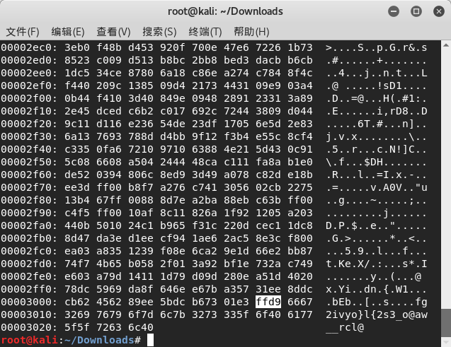

  JPEG图片开头是ffd8，末尾应该是ffd9.后面多出来一些内容，先把16进制转换成字符串

  

  按经验判断是一个栅栏密码，上网解码得到flag

  

14. linux

  这个题目有几种解法。

  解法一：

  下载到文件后，用binwalk分析一波，看到好像是由几个文件组成的。于是使用binwalk -e的命令将文件都分解出来，得到一个flag文本。里面就是flag

  解法二:

  下载到文件后使用`strings flag | grep flag`找其中的flag内容。

15. 隐写3

  下载来是一个图片。打开后提示CRC校验码出错，考虑是宽高被改动过了无法显示。这边有个小提示，windows下会忽略CRC校验码错误，显示图片。但是linux下会因为CRC校验码出错无法显示。

  使用系统自带工具hexeditor打开，17~20字节00 00 02 A7是宽，21~24字节00 00 01 00是高，30~33字节6D 7C 71 35是CRC校验码。

  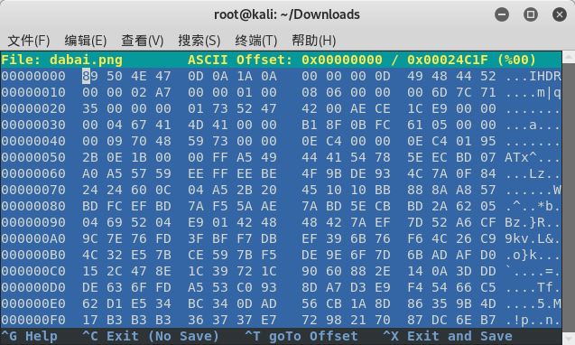

  随便修改了一下高度，图片还是无法显示(如果是windows系统里面，修改就会正常显示了)。于是在网上找了现成的计算代码，运行后会重新生成一个正常的图片。
  ```
import zlib
import struct
#读文件
file = 'dabai.png'
fr = open(file,'rb').read()
data = bytearray(fr[12:29])
crc32key =  0x6D7C7135 #需要自己填写30～33的16进制校验码
#crc32key = eval(str(fr[29:33]).replace('\\x','').replace("b'",'0x').replace("'",''))
n = 4095 #理论上0xffffffff,但考虑到屏幕实际，0x0fff就差不多了
for w in range(n):#高和宽一起爆破
    width = bytearray(struct.pack('>i', w))#q为8字节，i为4字节，h为2字节
    for h in range(n):
        height = bytearray(struct.pack('>i', h))
        for x in range(4):
            data[x+4] = width[x]
            data[x+8] = height[x]
            #print(data)
        crc32result = zlib.crc32(data)
        if crc32result == crc32key:
            print(width,height)
            #写文件
            newpic = bytearray(fr)
            for x in range(4):
                newpic[x+16] = width[x]
                newpic[x+20] = height[x]
            fw = open(file+'.png','wb')#保存副本
            fw.write(newpic)
            fw.close
  ```
  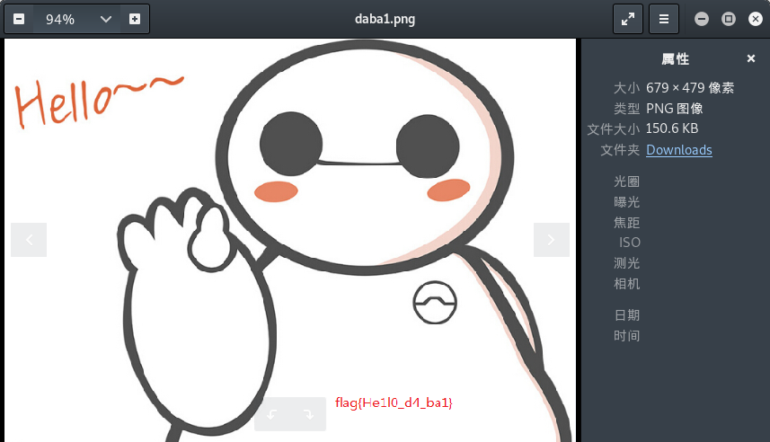


## 0x02 WEB

1. web2

  查看网页源代码，搞定。

2. 计算器

  登陆框只能填入一个数，无法填入完整答案。查看网页源代码修改字数限制，完成。

3. Web基础GET

  浏览器地址栏构造相应内容，完成。

4. Web基础POST

  我在burpsuite里面构造了没有效果，自己用python写了requests的简单脚本执行就成功了。奇怪。

5. 矛盾

  给了一个算法
  ```
  $num=$_GET['num'];
  if(!is_numeric($num))
  {
    echo $num;
    if($num==1)
    echo 'flag{**********}';
  }
  ```
  看题目的意思是，需要输出flag，那么需要经过两个判断：

  第一个判断是is_numberic($num)，是要求$num不能是数字类型。

  第二个判断是if($num==1)这个判断是要求$num等于1.

  所以num的值又要是等于1又要不是数字类型。

  有意思的是，根据php的特性，如果是通过'=='来判断等式两边是否相等，那么两边是可以相同的值而不是相同类型，例如if(1==‘1’)是对的。而if(1==='1')是不对的。

  这道题可以把$num赋值为1开头的任意字符，例如1fdsfsdfsf，那么就能通过两个判断。
  //todo 这是为什么呢?

6. web3

  打开页面是一个无聊的无限弹窗,ctrl+u查看到源代码后解码,完毕.

7. 域名解析

  > 听说把 flag.baidu.com 解析到123.206.87.240 就能拿到flag

  直接修改/etc/hosts文件就行了

8. 你必须让他停下

  页面里面有段js是让网页不停的自动刷新.设置浏览器不允许js,然后手动刷新几次界面就看到flag.

9. 本地包含

  ```
  <?php
      include "flag.php";
      $a = @$_REQUEST['hello'];
      eval( "var_dump($a);");
      show_source(__FILE__);
  ?>
  ```
  实际上就是要构造内容传递到eval语句中，将'var_dump('这部分进行闭合。所以可以构造hello的值为);show_source(%27%flag.php27);//
  这个题目最主要的就是有一句eval，var_dump函数无所谓是什么，换成md5函数都是可以的。有点类似SQL注入。

10. 变量1

  ```
  flag In the variable !
  <?php  
  error_reporting(0);
  include "flag1.php";
  highlight_file(__file__);
  if(isset($_GET['args'])){
      $args = $_GET['args'];
      if(!preg_match("/^\w+$/",$args)){
          die("args error!");
        }
        eval("var_dump($$args);");
      }
  ```
  粗略看下来这道题目和上一道题目有点像，但是其中多了点花样。一是新加了正则表达式对输入的参数进行过滤，不能够加入特殊符号除字母。二是`eval("var_dump($$args);");`这一句其中的参数有两个$符号。$$args可以理解成$($args)，比如$args='flag',那么$$args=$flag。
  因此考虑到全局变量$GLOBAL中可能包含了flag的信息，因此构造成`?args=GLOBALS`

11. web5

  打开页面是一个输入框，提示是`JSPFUCK??????答案格式CTF{******}`，之前知道有一个JSFUCK，不知道还有JSPFUCK。。。直接F12看了下源代码，发现熟悉的`)[!+[]+!+[]+!+[]]+(!![]+[])[+!+[]]])[+!+[]+[+[]]]+(!![]+[])[+!+[]]])[+!+[]+[+[]]]+(!![]+[])[+[]]+(!![]+[])[+!+[]]+([![]]+[][[]])[+!+[]+[+[]]]+([][[]]+[])[+!+[]]+(+![]+[![]]+([]+[])[([][(![]+[])[+[]]+([![]]+[][[]])[+!+`内容。但是由于这部分内容太多了，F12查看不完整，于是直接右键点击查看源代码拿到全部内容，放到consolo里面运行，拿到flag.

12. 头等舱

  打开页面什么也没有，看看头文件发现flag。

13. 网站被黑

  打开页面发现一个炫酷页面
  
  说明这个网站已经被黑，页面提示webshell，考虑到存在大马页面，使用kali自带的dirb工具扫描其他页面(这个工具其实蛮好用的)。发现shell页面
  
  看来是需要爆破了，使用burpsuite一波弱口令破解拿到flag。

14. 管理员系统

  首先有一个登陆框，尝试登陆时提示IP受限。F12查看源代码还得到一个BASE64字符串，解码为test123.
  

  获得以上信息后首先解决IP受限问题，修改X-Forwarded-For为127.0.0.1，后尝试以test123,test123登陆，提示密码错误。于是把用户名修改为admin，密码为test123成功登陆。

15. Web4

  打开页面提示看源代码，发现两个js变量p1,p2.
  
  利用浏览器的Console将两个变量使用unescape函数解析出来，组合成一组字符串。填入框中得到flag。

16. flag在index里

  根据查看首页、show.php、以及首页上的超链接，考虑到是一个文件包含漏洞。
  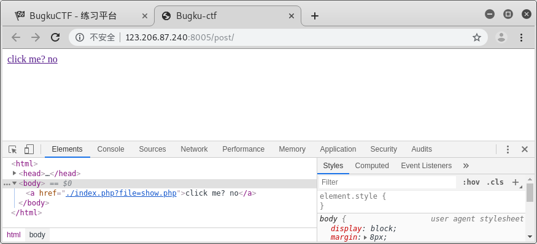

  因此按照套路构造协议url为xxx:/post/?file=php://filter/read=convert.base64-encode/resource=./index.php，拿到index.php的base64码
  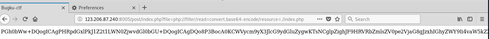

  解码以后得到flag.

17. 输入密码查看flag

  一个简单的爆破题目，提示了密码是5个数字。不详细写了。

18. 点击一百万次

  提示查看js，发现要求变量clicks到达100000次才出现flag.于是在console中输入clicks=10000，再次点击中间图案得到flag.

19. 备份是个好习惯

  题目提示备份,使用dirb工具查找后缀名为.bak的文件,得到index.php.bak.分析页面内容(后面注释是我添加的)
  ```
  <?php
  include_once "flag.php";
  ini_set("display_errors", 0);
  //获得URL中包含?之后的字符串
  $str = strstr($_SERVER['REQUEST_URI'], '?');
  //去掉?
  $str = substr($str,1);
  //替换到字符串中的key。但是很明显的漏洞是可以通过构造kkeyey绕过。
  $str = str_replace('key','',$str);
  //将$str变量中key1=a&key2=b的内容转换为$key1=a;$key2=b;
  parse_str($str);
  echo md5($key1);

  echo md5($key2);
  //key1与key2的md5值要相等，但是key1和key2的值不相等
  if(md5($key1) == md5($key2) && $key1 !== $key2){
      echo $flag."取得flag";
    }
  ?>
  ```
  通过以上代码分析，构造url比较简单，而md5那个地方以前遇到过，是md5和sha1都存在的一个漏洞，因为这两个函数无法解析数组,md5(key1[])会返回false，因此可以通过构造key1[]=a&key2[]=b解决。
  最终构造URL:?kekeyy1[]=a&kkeyey2[]=b

20. 成绩单

  一道简单的注入题目。不详细写了。

21. 秋名山老司机

  一道似曾相似的题目。页面中给出了一个超长计算式，需要迅速计算并把结果post到页面中。并且页面有中英文两种版本。
  

  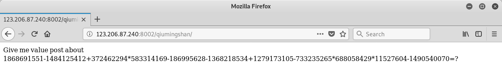

  仔细观察，知道算式是放在一个div里面。于是写出脚本拿到flag：
  ```
  import requests
  from bs4 import BeautifulSoup

  url = 'http://123.206.87.240:8002/qiumingshan/'
  req =  requests.Session()
  r_page1 = req.get(url)
  soup = BeautifulSoup(r_page1.content,'lxml')
  result = eval(soup.body.div.text[:-3])
  print(result)
  result = {'value': result}
  r_page2 = req.post(url=url,data=result)
  print(r_page2.content)
  ```
  需要注意的是，接受页面和提交结果都应该放在一个Session下来做，所以用了`requests.Session()`

22. Web6

  从原页面头中得到一个flag参数，里面都是base64码

  

  解码以后又拿到一个base64码

  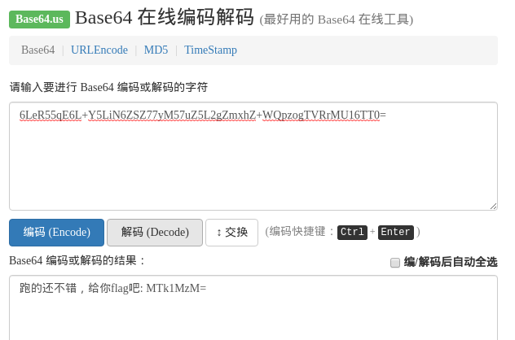
  再解码是一串数字。因为base64码不是不变的，于是写脚本提交数字，拿到flag.
  ```
  import requests
  import base64

  url = 'http://123.206.87.240:8002/web6/'
  req =  requests.Session()
  r = req.get(url)
  page1_result = base64.b64decode(r.headers['flag'])
  payload = str(page1_result).split(':')[1]
  payload = base64.b64decode(payload)
  data = {'margin': payload}
  r2 = req.post(url=url,data=data)
  print(r2.content)
  ```

23. cookies欺骗

  呼，感觉者这几题都是需要写代码，好麻烦。
  页面打开就发现URL不平常，包含了两个参数分别是line和filename
  解析字符串a2V5cy50eHQ=发现是keys.txt的base64码。于是把index.php进行base64编码后替换filename的值，再对代表行数的line不停的赋值1，2，3，4。。。,就得到了index.php文件的源代码。

  ```
  error_reporting(0);
  $file=base64_decode(isset($_GET['filename'])?$_GET['filename']:"");
  $line=isset($_GET['line'])?intval($_GET['line']):0;
  if($file=='') header("location:index.php?line=&filename=a2V5cy50eHQ=");
  $file_list = array(
    '0' =>'keys.txt',
    '1' =>'index.php',
    );
    if(isset($_COOKIE['margin']) && $_COOKIE['margin']=='margin'){
      $file_list[2]='keys.php';
    }
    if(in_array($file, $file_list)){
      $fa = file($file);
      echo $fa[$line];
    }
  ?>
  ```
  看来是需要在COOKIE中加入margin。并且filename的文件名改成keys.php的base64码
  

24. never give up

  打开页面没什么内容，F12查看源代码得到一个页面地址1p.html
    
  但是输入地址后浏览器就自动跳转了，使用burpsuite查看，得到1p.html中的一大段base64码.
  

  解密后就看到有点复杂的逻辑，但是不用管它。直接发现有个f4l2a3g.txt文件，访问后拿到flag
  
